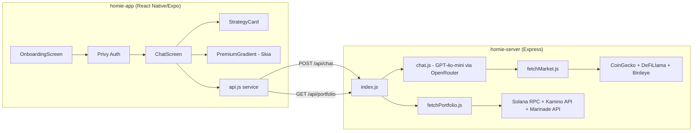
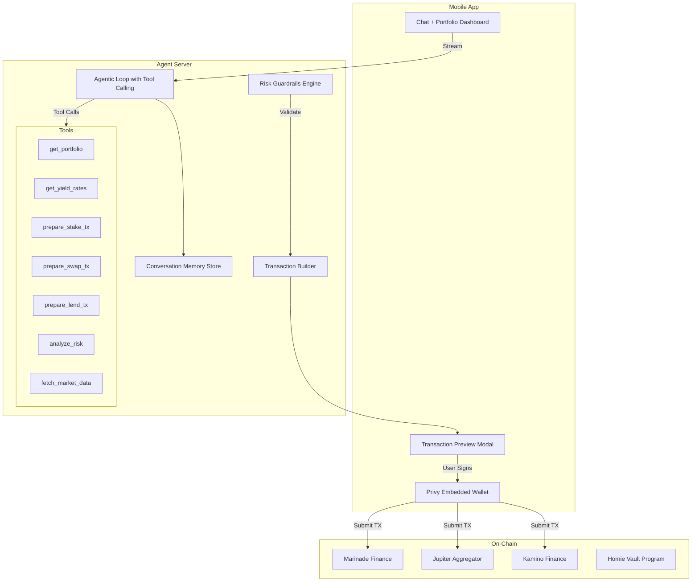

# 🔬 Homie — Complete Project Analysis & Hackathon Roadmap

> **Verdict: Homie is a solid DeFi chatbot, but NOT yet an autonomous agent.**
> The gap between "chatbot that suggests strategies" and "agent that executes strategies" is exactly what separates hackathon losers from winners.

---

## 📊 What You Have Today

### Architecture Overview



### Component Inventory

| Layer | File | What It Does | Status |
|:------|:-----|:-------------|:-------|
| **App** | `App.js` | Privy auth + navigation | ✅ Working |
| **App** | `OnboardingScreen.js` | Google/Apple/Email login | ✅ Working |
| **App** | `ChatScreen.js` | Chat UI with mode selector (Auto/Ask/Learn) | ✅ Working |
| **App** | `StrategyCard.js` | Renders strategy cards + Jupiter swap execution | ⚠️ Partial |
| **App** | `PremiumGradient.js` | Skia shader background | ✅ Working |
| **App** | `api.js` | HTTP client → server | ✅ Working |
| **Server** | `chat.js` | Single LLM call with market context injection | ✅ Working |
| **Server** | `parseIntent.js` | Intent classification (stake/lend/swap/yield) | ⚠️ **Unused** |
| **Server** | `fetchMarket.js` | SOL price, DeFiLlama pools, Birdeye trending | ✅ Working |
| **Server** | `fetchPortfolio.js` | SPL balances, Marinade, Kamino positions | ✅ Working |
| **Server** | `fetchRates.js` | Marinade/Kamino/Jupiter APYs | ⚠️ **Unused** |
| **Server** | `strategies.js` | Rule-based strategy engine | ⚠️ **Unused** |
| **Server** | `buildResponse.js` | Response formatter | ⚠️ **Unused** |

> [!WARNING]
> **4 out of 8 server modules are completely unused.** `parseIntent.js`, `fetchRates.js`, `strategies.js`, and `buildResponse.js` are dead code. The app only uses `chat.js` and `fetchPortfolio.js`. This means you built a strategy engine but never wired it in.

---

## 🔴 The 14 Critical Gaps (What's Missing)

### Tier 1 — DEAL BREAKERS (Judges will immediately notice)

#### 1. ❌ NO On-Chain Execution
**The single biggest gap.** Your app *suggests* strategies but cannot *execute* them (except a hardcoded Jupiter SOL→USDC swap in `StrategyCard.js`).

- Staking on Marinade? → Opens external URL
- Lending on Kamino? → Opens external URL  
- Any swap beyond SOL→USDC? → Opens external URL

**What winners do:** Build a **Transaction Builder** that constructs and signs real Solana transactions in-app using the Privy embedded wallet. The user says "stake 2 SOL on Marinade" and the agent *does it*.

#### 2. ❌ NO Transaction Confirmation Flow
Even the one swap you have skips confirmation. There's no:
- Pre-execution preview (showing fees, slippage, output amount)
- "Are you sure?" step
- Post-execution receipt with tx signature link to Solscan

**This is a security and UX red flag** that judges will catch.

#### 3. ❌ NO Conversation Memory
Every message is a cold start. The LLM has zero memory of what was said 30 seconds ago. User says "stake 5 SOL" → AI responds → User says "do it" → AI has NO IDEA what "it" refers to.

**What winners do:** Maintain a sliding window of conversation history (last 10-20 messages) sent to the LLM.

#### 4. ❌ NO Tool/Function Calling
You're using a single monolithic LLM prompt and praying the JSON output is correct. Modern AI agents use **tool calling** — the LLM decides which tool to invoke (check_balance, execute_swap, fetch_yield_rates, etc.) and the server orchestrates the execution.

**This is the architectural difference between a chatbot and an agent.**

---

### Tier 2 — COMPETITIVE DISADVANTAGES (Other teams will have these)

#### 5. ❌ NO Autonomous Loop / Proactive Behavior
Your agent is purely reactive — it only does something when the user types. Winning agents:
- Monitor positions and **alert** when health factor drops
- Auto-rebalance when APY differentials exceed thresholds
- Send push notifications: "SOL just dropped 8%, want me to hedge?"

#### 6. ❌ NO Multi-Step Strategy Execution
Real DeFi strategies are multi-step:
- "Swap 2 SOL → USDC → Lend on Kamino" = 2 transactions
- "Unstake mSOL → Swap to USDC → Lend" = 3 transactions

Your system can only think in single actions.

#### 7. ❌ NO Risk Engine / Guardrails
There are no hard limits:
- What if the AI suggests swapping ALL SOL? (User can't pay gas)
- What if slippage is 10%? 
- What if a pool APY dropped to 0.01% since the data was cached?
- No max-per-trade limit, no daily limits, no "are you sure?" for large amounts

#### 8. ❌ NO Portfolio Analytics Dashboard
Users can't see:
- Total portfolio value in USD
- Historical performance (even basic P&L)
- Asset allocation breakdown (pie chart)
- Position health monitoring

Everything is text in a chat bubble. Judges expect visual data.

#### 9. ❌ Dead Code / Unused Architecture
`parseIntent.js`, `strategies.js`, `fetchRates.js`, `buildResponse.js` — these are solid modules that show good architectural thinking, but they're **completely disconnected** from the main flow (`chat.js` does everything itself). This creates confusion and wasted effort.

---

### Tier 3 — POLISH & DIFFERENTIATION (What makes you "god-level")

#### 10. ❌ NO Smart Contract / On-Chain Program
You have no Solana program. Every winning DeFi dApp has some on-chain component:
- A vault contract that holds funds
- An escrow for pending strategies  
- On-chain strategy execution via CPI (Cross-Program Invocation)

#### 11. ❌ NO Cross-Protocol Yield Optimizer
You support Marinade + Kamino + Jupiter. But you're not comparing them intelligently:
- Which combination maximizes risk-adjusted return?
- Should user split 50/50 between staking and lending?
- What about protocols you don't cover (Raydium, Drift, Marginfi, Tensor)?

#### 12. ❌ NO Streaming / Real-Time Responses
Chat responses block until the full LLM response arrives. Modern AI apps stream tokens in real-time (like ChatGPT). This is a huge UX win.

#### 13. ❌ Security Issues
- **API key exposed in `.env` committed to repo** (OPENROUTER_API_KEY is visible)
- **No rate limiting** on the Express server — anyone can spam your LLM endpoint  
- **No input validation/sanitization** on user messages (prompt injection risk)
- **No HTTPS** or authentication on API endpoints
- **Privy App ID hardcoded** in client source code (minor, but noted)

#### 14. ❌ No Testing, No CI/CD, No Error Tracking
- Zero test files
- No error tracking (Sentry, etc.)
- No deployment pipeline
- No API documentation

---

## 🏆 The Hackathon-Winning Roadmap

### Priority Matrix

| Priority | Feature | Impact | Effort | Do When |
|:---------|:--------|:-------|:-------|:--------|
| 🔴 P0 | Conversation memory | 🟢 High | 🟢 2hrs | **NOW** |
| 🔴 P0 | Wire up unused modules | 🟢 High | 🟢 2hrs | **NOW** |
| 🔴 P0 | Tool/Function calling agent | 🔴 Critical | 🟡 6hrs | **NOW** |
| 🔴 P0 | Real on-chain execution (3+ protocols) | 🔴 Critical | 🔴 8hrs | **Day 1** |
| 🔴 P0 | Transaction confirmation UI | 🟢 High | 🟡 3hrs | **Day 1** |
| 🟡 P1 | Streaming responses (SSE) | 🟡 Medium | 🟡 3hrs | **Day 2** |
| 🟡 P1 | Portfolio dashboard screen | 🟢 High | 🟡 4hrs | **Day 2** |
| 🟡 P1 | Risk guardrails engine | 🟢 High | 🟡 3hrs | **Day 2** |
| 🟡 P1 | Multi-step strategy execution | 🟢 High | 🟡 4hrs | **Day 2** |
| 🟢 P2 | Autonomous monitoring loop | 🟡 Medium | 🟡 4hrs | **Day 3** |
| 🟢 P2 | On-chain vault program | 🟡 Medium | 🔴 8hrs | **Day 3** |
| 🟢 P2 | Cross-protocol yield optimizer | 🟡 Medium | 🟡 4hrs | **Day 3** |

---

## 🛠️ Detailed Implementation Guide for Top 5 Features

### 1. Tool-Calling Agent Architecture (THE MOST IMPORTANT CHANGE)

Transform from "one-shot LLM prompt" to a real agentic loop:

```
Current Flow (Chatbot):
User → LLM (one call) → JSON response → Display

Winning Flow (Agent):  
User → LLM decides which TOOL to call → Execute tool → 
LLM sees result → Decides next tool OR responds → Display
```

**Implementation:**

```javascript
// server/src/ai/agent.js — NEW FILE
const TOOLS = [
  {
    type: "function",
    function: {
      name: "get_portfolio",
      description: "Fetch user's current Solana portfolio including SOL balance, SPL tokens, and DeFi positions",
      parameters: { type: "object", properties: { wallet: { type: "string" } }, required: ["wallet"] }
    }
  },
  {
    type: "function", 
    function: {
      name: "get_yield_rates",
      description: "Fetch live APY rates from Marinade, Kamino, and top DeFi pools",
      parameters: { type: "object", properties: {} }
    }
  },
  {
    type: "function",
    function: {
      name: "prepare_stake_transaction",
      description: "Build a Marinade staking transaction for the user to sign",
      parameters: {
        type: "object",
        properties: {
          amount_sol: { type: "number", description: "Amount of SOL to stake" },
          wallet: { type: "string" }
        },
        required: ["amount_sol", "wallet"]
      }
    }
  },
  {
    type: "function",
    function: {
      name: "prepare_swap_transaction", 
      description: "Build a Jupiter swap transaction",
      parameters: {
        type: "object",
        properties: {
          input_token: { type: "string" },
          output_token: { type: "string" },
          amount: { type: "number" },
          wallet: { type: "string" }
        },
        required: ["input_token", "output_token", "amount", "wallet"]
      }
    }
  },
  {
    type: "function",
    function: {
      name: "prepare_lend_transaction",
      description: "Build a Kamino lending deposit transaction", 
      parameters: {
        type: "object",
        properties: {
          token: { type: "string" },
          amount: { type: "number" },
          wallet: { type: "string" }
        },
        required: ["token", "amount", "wallet"]
      }
    }
  }
];

// The agent LOOP — LLM calls tools, sees results, decides next action
async function agentChat(messages, walletContext) {
  const response = await client.chat.completions.create({
    model: "openai/gpt-4o-mini",
    messages,
    tools: TOOLS,
    tool_choice: "auto",
  });

  const msg = response.choices[0].message;
  
  // If LLM wants to call tools
  if (msg.tool_calls) {
    const toolResults = await Promise.all(
      msg.tool_calls.map(tc => executeToolCall(tc, walletContext))
    );
    
    // Feed results back to LLM for next decision
    messages.push(msg);
    for (const result of toolResults) {
      messages.push({ role: "tool", tool_call_id: result.id, content: JSON.stringify(result.data) });
    }
    
    // Recursive — LLM may want to call MORE tools
    return agentChat(messages, walletContext);
  }
  
  // LLM decided to respond to user
  return JSON.parse(msg.content);
}
```

### 2. Conversation Memory

```javascript
// In /api/chat endpoint — add conversation history
app.post("/api/chat", async (req, res) => {
  const { message, walletAddress, conversationHistory = [] } = req.body;
  
  // Keep last 20 messages for context
  const trimmedHistory = conversationHistory.slice(-20);
  
  const messages = [
    { role: "system", content: systemPrompt },
    ...trimmedHistory,
    { role: "user", content: message }
  ];
  
  const response = await agentChat(messages, walletContext);
  res.json(response);
});
```

```javascript
// In ChatScreen.js — maintain history in state  
const [conversationHistory, setConversationHistory] = useState([]);

async function send() {
  const newHistory = [...conversationHistory, { role: "user", content: text }];
  
  const data = await askHomie(text, { 
    walletAddress, solBalance, tradeMode, portfolio,
    conversationHistory: newHistory  // Send full history
  });
  
  setConversationHistory([
    ...newHistory,
    { role: "assistant", content: JSON.stringify(data) }
  ]);
}
```

### 3. Real On-Chain Execution (Marinade Staking Example)

```javascript
// server/src/engine/transactionBuilder.js — NEW FILE
const { Connection, PublicKey, Transaction, SystemProgram } = require("@solana/web3.js");

async function buildMarinadeStakeTransaction(amountSol, walletAddress) {
  const connection = new Connection(RPC);
  const wallet = new PublicKey(walletAddress);
  const amountLamports = Math.floor(amountSol * 1e9);
  
  // Use Marinade SDK or build the instruction manually
  // Return serialized transaction for client to sign
  const marinadeProgram = new PublicKey("MarBmsSgKXdrN1egZf5sqe1TMai9K1rChYNDJgjq7aD");
  
  // ... build instruction ...
  
  return {
    type: "transaction_preview",
    protocol: "Marinade Finance",
    action: `Stake ${amountSol} SOL → mSOL`,
    estimatedOutput: `~${(amountSol * 0.98).toFixed(4)} mSOL`,
    fee: "~0.000005 SOL",
    serializedTx: base64EncodedTx,  // Client deserializes and signs
    requiresApproval: true
  };
}
```

### 4. Transaction Confirmation UI (App Side)

```javascript
// New component: TransactionPreview.js
// Shows: protocol, action, estimated output, fees, risk level
// Two buttons: [Cancel] [Confirm & Sign]
// On confirm: deserialize tx → sign with Privy wallet → send to chain → show receipt
```

### 5. Streaming Responses (SSE)

```javascript
// Server: Switch to Server-Sent Events
app.post("/api/chat/stream", async (req, res) => {
  res.setHeader("Content-Type", "text/event-stream");
  res.setHeader("Cache-Control", "no-cache");
  
  const stream = await client.chat.completions.create({
    model: "openai/gpt-4o-mini",
    messages,
    stream: true,
  });
  
  for await (const chunk of stream) {
    const content = chunk.choices[0]?.delta?.content;
    if (content) res.write(`data: ${JSON.stringify({ content })}\n\n`);
  }
  res.write("data: [DONE]\n\n");
  res.end();
});
```

---

## 🏗️ Recommended Final Architecture



---

## 📋 Quick Win Checklist (Do These TODAY)

- [ ] **Wire `parseIntent.js` + `strategies.js` + `buildResponse.js`** into the main flow — you already wrote them!
- [ ] **Add conversation history** to `/api/chat` (2 hour fix)
- [ ] **Add rate limiting** to Express server (`express-rate-limit` package)
- [ ] **Remove API key from `.env`** and add `.env` to `.gitignore`
- [ ] **Add basic tool calling** with at least 3 tools (portfolio, rates, swap)
- [ ] **Add a Portfolio screen** as a second tab (use the portfolio data you already fetch)
- [ ] **Fix the trade mode** — "Auto/Ask/Learn" exists in UI but is passed as a string and largely ignored by the LLM

---

## 🎯 What Judges Are Looking For

| Criteria | Your Score | Target |
|:---------|:-----------|:-------|
| **Innovation / Novelty** | 4/10 — Chat + DeFi is common | 8/10 — Autonomous agent with tool calling |
| **Technical Execution** | 5/10 — Good foundation, lots of dead code | 9/10 — Working agent loop with real txs |
| **On-Chain Integration** | 2/10 — Only Jupiter swap works | 9/10 — Stake, lend, swap, all in-app |
| **User Experience** | 6/10 — Beautiful UI, but text-only | 9/10 — Visual portfolio + streaming + confirmations |
| **Security / Risk Mgmt** | 2/10 — API key exposed, no guardrails | 8/10 — Rate limits, guardrails, tx previews |
| **Demo Impact** | 5/10 — Can show chat | 10/10 — Live stake + swap on devnet |
| **TOTAL** | **24/60** | **53/60** |

> [!IMPORTANT]
> **The single biggest thing you can do right now:** Replace the monolithic `chat.js` with a tool-calling agent loop. This transforms your project from "AI chatbot that displays cards" to "autonomous agent that can actually DO things on Solana." Every hackathon winner in 2025-2026 has this.

---

## 💡 Killer Demo Script (For Presentations)

1. **Open app** → Show beautiful onboarding → Login with Google
2. **"What's my portfolio?"** → Agent calls `get_portfolio` tool → Shows visual breakdown
3. **"Where should I put my SOL for maximum yield?"** → Agent calls `get_yield_rates` + `get_market_data` → Returns ranked strategies with REAL APYs
4. **"Stake 1 SOL on Marinade"** → Agent calls `prepare_stake_tx` → **Transaction preview pops up** → User taps "Confirm" → **TX executes on-chain** → Shows Solscan link
5. **"Now lend 0.5 SOL on Kamino"** → Agent remembers context → Same flow → **Second TX on-chain**
6. **"Alert me if SOL drops below $120"** → Agent sets up monitoring → (Bonus: show push notification)

**This demo takes 2 minutes and will blow judges' minds.**
